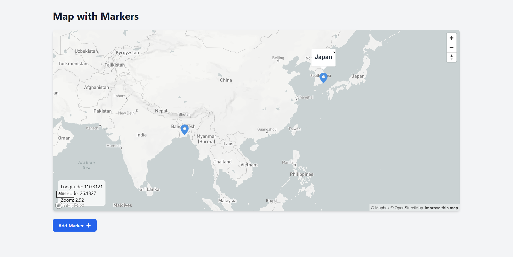

# Project: Mapbox with Marker Addition Feature in React

## Introduction

This project demonstrates the integration of the **Mapbox GL JS** within a React application to display an interactive map, allowing users to add custom markers at specified locations. The app enables users to input latitude and longitude coordinates, along with a marker name, which is then displayed on the map. The markers are stored locally for persistence and the map is centered and zoomed to display all markers appropriately.

## UI



## Installation

1. Clone the repository:
   ```bash
   git clone https://github.com/yourusername/mapbox-react.git
   cd mapbox-react
   ```
